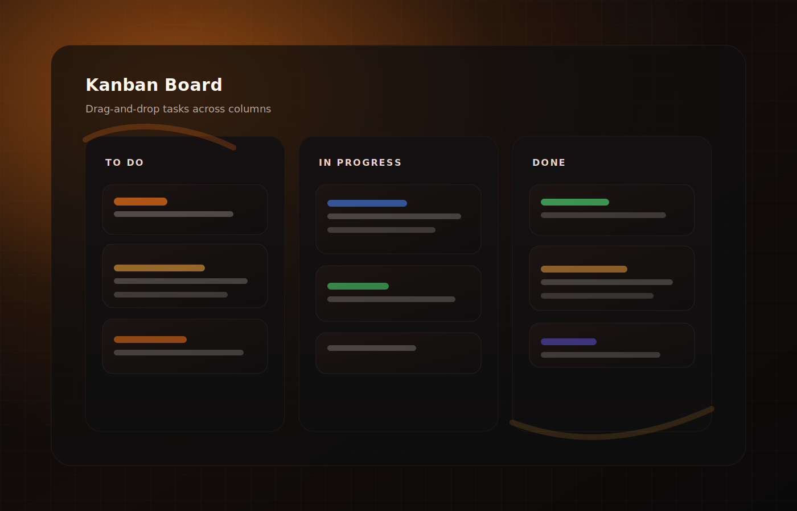
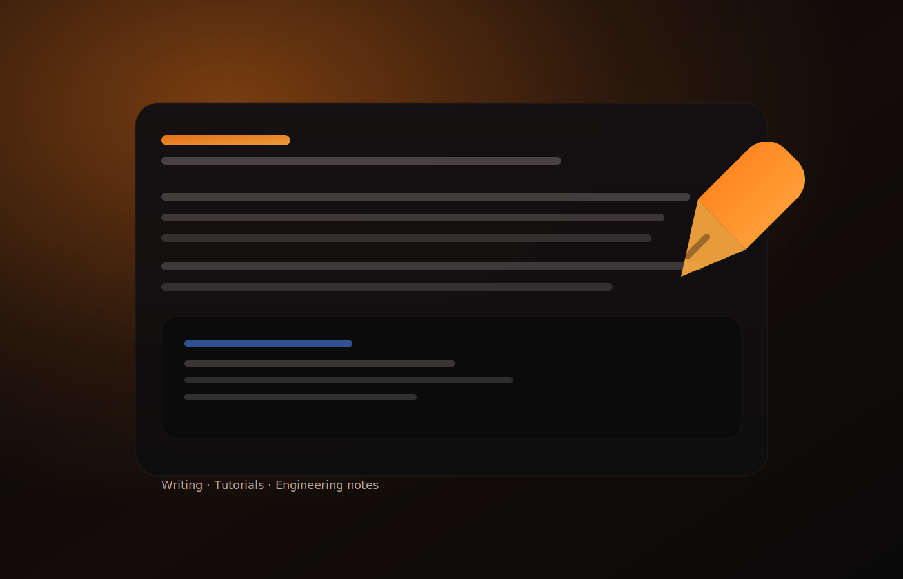

# Ember Noir Portfolio

React + Vite portfolio site with a lightweight profile chat API.

## Tech Stack

- Frontend: React 19 + Vite 7
- API: Node-style serverless function (`api/chat.js`) for Vercel
- Shared logic: Intent matching and response generation in `shared/profileBrain.mjs`

## Project Structure

```text
.
├── api/
│   └── chat.js                  # Production serverless endpoint: /api/chat
├── scripts/
│   └── dev-api.mjs              # Local API server for development
├── shared/
│   └── profileBrain.mjs         # Intent rules + response text
├── src/
│   ├── App.jsx                  # Main app + chat UI and API calls
│   ├── styles.css
│   └── assets/
├── public/
└── vite.config.js
```

## How the Chat API Works

### 1) Frontend request flow (`src/App.jsx`)

- Chat input calls `addMessage(text)`.
- App sends `POST /api/chat` with JSON body:

```json
{ "message": "What ML projects have you done?" }
```

- UI handles:
  - `429` as rate limit message
  - non-OK responses as temporary failure text
  - successful response as assistant bubble

### 2) API endpoint (`api/chat.js`)

`api/chat.js` exports a default handler for Vercel:

- Accepts `GET` and `POST`
- Extracts IP from `x-forwarded-for` (fallback to socket address)
- Applies in-memory rate limiting:
  - window: 60 seconds
  - max: 12 requests per IP
- Reads JSON payload for `POST` (with 20KB body guard)
- Resolves response via `answerProfileQuestion(...)`
- Returns:

```json
{ "reply": "...", "intent": "projects" }
```

Status behavior:

- `200`: valid response
- `405`: method not allowed (only `GET, POST`)
- `429`: rate limited

### 3) Intent engine (`shared/profileBrain.mjs`)

- Contains profile facts and links in `PROFILE`.
- Defines rule-based intents in `INTENTS`:
  - greeting
  - nielsen
  - education
  - cpp_windows
  - ml
  - projects
  - writing
  - contact
- Matches user text using keyword scoring.
- Returns:
  - best intent response
  - fallback response if no strong keyword match
  - empty-input prompt when message is blank

## Local Development

Install and run:

```bash
npm install
npm run dev
```

`npm run dev` starts:

- Vite frontend dev server
- Local API server (`scripts/dev-api.mjs`) on `http://localhost:8787`

## Build

```bash
npm run build
npm run preview
```

## Deployed Behavior (Vercel)

- Static frontend from Vite build output (`dist/`)
- Serverless API from `api/chat.js` available at `/api/chat`

## Website Images

### About Section


### Portfolio Assets





